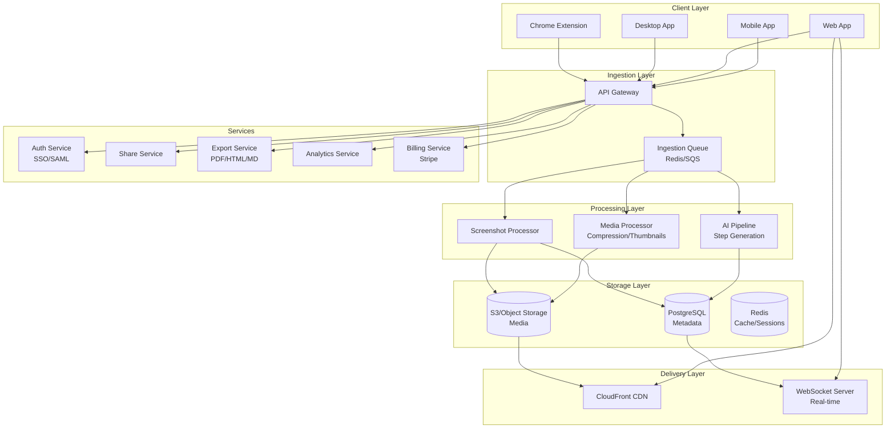

# SCRIBE TECHNICAL BLUEPRINT & ENGINEERING PRD

## Functionele Clone voor Workflow Documentation Platform

**Versie:** 1.0
**Datum:** 21 januari 2026
**Auteur:** Claude Opus 4.5 (AI-assisted research)

---

## A) EXECUTIVE TECH SUMMARY

### Wat is Scribe?

Scribe is een $1.3B gewaardeerd AI-platform (Series C, november 2025) dat automatisch stap-voor-stap handleidingen genereert door workflows vast te leggen. Het product combineert:

1. **Browser Extension Capture**: Detecteert clicks, inputs, navigatie en maakt screenshots
2. **AI Text Generation**: Genereert instructietekst per stap via OpenAI APIs
3. **Editor & Collaboration**: Bewerk screenshots, voeg annotaties toe, deel met teams
4. **Enterprise Features**: SSO, RBAC, automatische PII-redactie, analytics

### Kernstatistieken (publiek geverifieerd)

| Metriek | Waarde | Bron |
|---------|--------|------|
| Valuatie | $1.3B | TechCrunch Nov 2025 |
| Funding | $130M totaal | Series C announcement |
| Users | 5+ miljoen MAU | Chrome Web Store |
| Enterprise | 94% Fortune 500 | Scribe website |
| Apps supported | 40,000+ | Marketing materials |

### Technische Stack (geinfereerd)

| Component | Technology | Confidence |
|-----------|------------|------------|
| Frontend (Webapp) | React, Next.js, TypeScript | Midden (job postings) |
| Browser Extension | Chrome MV3, Content Scripts | Hoog (publieke APIs) |
| Desktop App | Electron of Avalonia (C#) | Laag-Midden |
| Backend | Node.js/Python, PostgreSQL | Midden (job postings) |
| AI/ML | OpenAI APIs (GPT), custom models | Hoog (privacy policy) |
| Infrastructure | AWS (SOC 2 certified) | Hoog (security page) |
| CDN | CloudFront of vergelijkbaar | Midden |

### Juridische Overwegingen

| Risico | Mitigatie |
|--------|-----------|
| **Trade dress** | Eigen UI design, geen pixel-perfecte kopie |
| **Patents** | Focus op publieke APIs en standaard patterns |
| **ToS violation** | Geen scraping van Scribe, alleen publieke info |
| **Copyright** | Eigen implementatie, geen code kopieren |

**Aanbeveling**: Bouw "functioneel equivalent" product met eigen UX, niet een exacte kopie.

---

## B) SYSTEM ARCHITECTURE

### High-Level Architecture Diagram



### Data Flow: Recording to Published Guide

```
1. USER STARTS RECORDING
   ├── Extension injects content script
   ├── Registers event listeners (click, input, navigation)
   └── Opens WebSocket for real-time sync

2. USER PERFORMS ACTION (e.g., click)
   ├── Content script captures:
   │   ├── Event type & timestamp
   │   ├── Element selector (CSS/XPath)
   │   ├── Element text/label
   │   └── Bounding box coordinates
   ├── Waits 50-150ms for DOM settle
   ├── Triggers screenshot via background script
   └── Sends payload to ingestion API

3. INGESTION API
   ├── Validates auth token
   ├── Generates step ID + idempotency check
   ├── Queues for processing
   └── Returns acknowledgment

4. PROCESSING PIPELINE (async)
   ├── Screenshot Processor:
   │   ├── Compress (WebP/AVIF)
   │   ├── Generate thumbnails (320, 640, 1280px)
   │   ├── Perceptual hash for deduplication
   │   └── Upload to S3
   ├── AI Pipeline:
   │   ├── OCR on screenshot (Google Vision/PaddleOCR)
   │   ├── Extract element context from DOM data
   │   ├── Generate step description (Claude Haiku)
   │   ├── Quality check (PII, hallucination)
   │   └── Cache result for similar inputs
   └── Update database with processed step

5. REAL-TIME UPDATE
   ├── WebSocket notifies client
   ├── UI updates with new step
   └── User can edit inline

6. USER STOPS RECORDING
   ├── Finalize workflow metadata
   ├── Generate title (AI)
   ├── Create share link
   └── Ready for viewing/export
```

---

## C) COMPONENT-BY-COMPONENT SPECIFICATIONS

### C1. Browser Extension (Chrome/Edge)

**Verantwoordelijkheden:**
- Capture user interactions (clicks, inputs, navigation)
- Take screenshots at appropriate moments
- Extract DOM element information
- Communicate with backend API
- Display recording UI overlay

**Inputs:**
- User actions (mouse events, keyboard events)
- DOM state
- Navigation events

**Outputs:**
- Screenshots (PNG/JPEG base64)
- Step metadata (selector, text, coordinates)
- Workflow session data

**Manifest Permissions (MV3):**
```json
{
  "permissions": [
    "activeTab",
    "scripting",
    "storage",
    "tabs"
  ],
  "host_permissions": ["<all_urls>"]
}
```

**Edge Cases & Failure Modes:**

| Scenario | Handling |
|----------|----------|
| Cross-origin iframe | Cannot access content; capture parent only |
| Shadow DOM | Traverse open shadow roots; closed = skip |
| SPA navigation | MutationObserver + URL change detection |
| Rapid clicks (<150ms) | Debounce; combine into single step |
| Extension crash | Persist queue in chrome.storage.local |
| Offline mode | Queue screenshots locally; sync on reconnect |

**Confidence:** Hoog (gebaseerd op publieke Chrome APIs)

---

### C2. Desktop Application

**Verantwoordelijkheden:**
- Capture desktop applications (Excel, legacy software)
- Multi-monitor support
- System-level screenshot capture
- Menu bar/tray integration

**Technology Options:**

| Option | Pros | Cons |
|--------|------|------|
| Electron | Cross-platform, web tech | Heavy, memory usage |
| Tauri | Lightweight, Rust | Newer ecosystem |
| Avalonia (C#) | Native performance | Windows-focused |

**Screen Capture APIs:**
- Windows: DXGI Desktop Duplication API
- macOS: CGWindowListCreateImage
- Linux: X11/Wayland protocols

**Confidence:** Midden (geen publieke info over Scribe's implementatie)

---

### C3. Backend API Services

#### C3.1 Auth Service

**Verantwoordelijkheden:**
- User registration/login
- SSO/SAML integration (Enterprise)
- JWT token management
- RBAC enforcement

**Endpoints:**
```
POST /api/auth/register
POST /api/auth/login
POST /api/auth/logout
POST /api/auth/refresh
POST /api/auth/sso/saml
GET  /api/auth/me
```

**SSO Flow (SAML 2.0):**
```
1. User clicks "SSO Login"
2. Redirect to IdP (Okta, Azure AD)
3. User authenticates
4. IdP sends SAML assertion
5. Backend validates assertion
6. Create/update user record
7. Issue JWT tokens
8. Redirect to app
```

---

#### C3.2 Recording Ingestion Service

**Verantwoordelijkheden:**
- Accept screenshot + metadata uploads
- Validate and normalize data
- Queue for async processing
- Return step ID immediately

**Endpoints:**
```
POST /api/workflows                    # Create new workflow
POST /api/workflows/:id/steps          # Add step to workflow
PUT  /api/workflows/:id/steps/:stepId  # Update step
DELETE /api/workflows/:id/steps/:stepId # Remove step
POST /api/workflows/:id/complete       # Finalize workflow
```

**Request Schema (Add Step):**
```json
{
  "screenshot": "data:image/png;base64,...",
  "metadata": {
    "action_type": "click",
    "element_selector": "#submit-button",
    "element_text": "Submit",
    "bounding_box": {"x": 100, "y": 200, "width": 80, "height": 40},
    "url": "https://example.com/form",
    "timestamp": 1706000000000
  }
}
```

**Idempotency:**
- Client sends `Idempotency-Key` header
- Server checks Redis for duplicate
- Returns cached response if duplicate

---

#### C3.3 AI Pipeline Service

**Verantwoordelijkheden:**
- Generate step descriptions from screenshot + DOM data
- Generate workflow titles
- Detect PII for automatic redaction
- Suggest workflow improvements

**Processing Flow:**
```
Input: Screenshot + DOM metadata
    ↓
1. OCR (Google Vision / PaddleOCR fallback)
    ↓
2. Build prompt with:
   - Screenshot text
   - Element label/role
   - Previous step context
   - Domain (SaaS, ecommerce, etc.)
    ↓
3. Call LLM (Claude Haiku for speed/cost)
    ↓
4. Quality check:
   - PII detection
   - Hallucination check (element exists?)
   - Clarity score
    ↓
5. Cache result
    ↓
Output: Step description + confidence score
```

**Model Selection:**

| Use Case | Model | Reason |
|----------|-------|--------|
| Step description | Claude Haiku | Fast, cheap, good enough |
| Complex workflows | Claude Sonnet | Better reasoning |
| Title generation | Claude Haiku | Simple task |
| PII detection | Regex + Haiku | Hybrid approach |

**Cost Optimization:**
- Semantic caching: 35% hit rate target
- Prompt prefix caching: 81% cost reduction after 4 reuses
- Model routing: 90% Haiku, 8% Sonnet, 2% Opus

---

#### C3.4 Media Service

**Verantwoordelijkheden:**
- Image compression (WebP, AVIF, JPEG)
- Thumbnail generation (320, 640, 1280, 2560px)
- Perceptual hashing for deduplication
- Storage lifecycle management (hot/warm/cold)

**Processing Pipeline:**
```
Original PNG
    ↓
1. Generate formats in parallel:
   - AVIF @70 quality (50% smaller)
   - WebP @80 quality (30% smaller)
   - JPEG @85 quality (fallback)
    ↓
2. Generate thumbnails
    ↓
3. Calculate perceptual hash (dHash)
    ↓
4. Check for duplicates
    ↓
5. Upload to S3 with CDN headers
    ↓
6. Update database with URLs
```

**Storage Tiers:**
- Hot (0-30 days): S3 Standard, SSD
- Warm (30-90 days): S3 Intelligent-Tiering
- Cold (90+ days): S3 Glacier (compliance)

---

#### C3.5 Export Service

**Verantwoordelijkheden:**
- Generate PDF exports (Puppeteer)
- Generate HTML (standalone, embeddable)
- Generate Markdown
- Sync to Notion/Confluence

**PDF Generation (Puppeteer):**
```javascript
const pdf = await page.pdf({
  format: 'A4',
  margin: { top: '20mm', right: '20mm', bottom: '20mm', left: '20mm' },
  displayHeaderFooter: true,
  headerTemplate: '<div>Workflow Title</div>',
  footerTemplate: '<div>Page <span class="pageNumber"></span></div>',
  printBackground: true
});
```

**Edge Cases:**
- Large workflows (>100 steps): Split into chunks, merge PDFs
- Missing fonts: System fallbacks
- Timeout: 60s max, retry with simplified layout

---

#### C3.6 Share Service

**Verantwoordelijkheden:**
- Generate short URLs (nanoid)
- Manage access permissions
- Track view analytics
- Handle password protection

**Share Link Options:**
```json
{
  "expires_in_days": 7,
  "max_views": 100,
  "require_password": true,
  "can_download": true,
  "can_comment": false
}
```

**Token Strategy:**
- Access token: JWT, 15 min expiry
- Refresh token: Opaque, 7 days expiry
- Share link: nanoid(21), no auth required (optional password)

---

#### C3.7 Analytics Service

**Verantwoordelijkheden:**
- Track page views, completions
- Calculate engagement metrics
- Generate team dashboards
- Privacy-compliant (no PII)

**Event Schema:**
```json
{
  "event_type": "step_viewed",
  "session_id": "sess_abc123",
  "workflow_id": "wf_xyz789",
  "properties": {
    "step_index": 3,
    "time_on_step": 45,
    "scroll_depth": 80
  },
  "timestamp": 1706000000000
}
```

**Metrics Tracked:**
- Views per workflow (unique + total)
- Completion rate (% who view all steps)
- Average time per step
- Export count by format
- Top workflows by team

---

#### C3.8 Billing Service

**Verantwoordelijkheden:**
- Stripe subscription management
- Seat-based billing
- Usage tracking
- Invoice generation

**Pricing Model (based on Scribe):**

| Plan | Price | Features |
|------|-------|----------|
| Free | $0 | Web capture, basic export, 1 user |
| Pro Personal | $23/mo | Desktop app, PDF export, branding |
| Pro Team | $12/seat/mo (min 5) | Collaboration, viewer licenses |
| Enterprise | Custom | SSO, RBAC, auto-redaction, API |

**Stripe Integration:**
```javascript
// Create subscription
const subscription = await stripe.subscriptions.create({
  customer: customerId,
  items: [{ price: 'price_xxx', quantity: seats }],
  trial_period_days: 14
});
```

---

## D) DATA MODEL (ERD)

### Entity Relationship Diagram

```
┌─────────────────┐       ┌─────────────────┐       ┌─────────────────┐
│      User       │       │      Team       │       │   Workspace     │
├─────────────────┤       ├─────────────────┤       ├─────────────────┤
│ id (PK)         │───────│ id (PK)         │───────│ id (PK)         │
│ email           │       │ name            │       │ name            │
│ name            │       │ owner_id (FK)   │       │ team_id (FK)    │
│ password_hash   │       │ created_at      │       │ created_at      │
│ sso_provider    │       └─────────────────┘       └─────────────────┘
│ created_at      │               │                         │
└─────────────────┘               │                         │
        │                         ▼                         ▼
        │                 ┌─────────────────┐       ┌─────────────────┐
        │                 │  TeamMembership │       │    Workflow     │
        │                 ├─────────────────┤       ├─────────────────┤
        └─────────────────│ user_id (FK)    │       │ id (PK)         │
                          │ team_id (FK)    │       │ workspace_id(FK)│
                          │ role            │       │ created_by (FK) │
                          │ joined_at       │       │ title           │
                          └─────────────────┘       │ description     │
                                                    │ status          │
                                                    │ created_at      │
                                                    │ updated_at      │
                                                    └─────────────────┘
                                                            │
                                                            ▼
┌─────────────────┐       ┌─────────────────┐       ┌─────────────────┐
│   Screenshot    │◄──────│      Step       │       │   ShareLink     │
├─────────────────┤       ├─────────────────┤       ├─────────────────┤
│ id (PK)         │       │ id (PK)         │       │ id (PK)         │
│ step_id (FK)    │       │ workflow_id(FK) │       │ workflow_id(FK) │
│ s3_key          │       │ position        │       │ short_id        │
│ formats (JSON)  │       │ title           │       │ password_hash   │
│ thumbnails(JSON)│       │ description     │       │ expires_at      │
│ width, height   │       │ action_type     │       │ max_views       │
│ phash           │       │ element_selector│       │ view_count      │
│ created_at      │       │ element_text    │       │ created_at      │
└─────────────────┘       │ bounding_box    │       └─────────────────┘
                          │ url             │
                          │ ai_generated    │
                          │ confidence      │
                          │ created_at      │
                          └─────────────────┘
```

### SQL Schema

```sql
-- Users
CREATE TABLE users (
  id UUID PRIMARY KEY DEFAULT gen_random_uuid(),
  email VARCHAR(255) UNIQUE NOT NULL,
  name VARCHAR(255),
  password_hash BYTEA,
  sso_provider VARCHAR(50),
  sso_id VARCHAR(255),
  avatar_url TEXT,
  created_at TIMESTAMPTZ DEFAULT NOW(),
  updated_at TIMESTAMPTZ DEFAULT NOW(),
  deleted_at TIMESTAMPTZ,

  INDEX idx_email (email),
  INDEX idx_sso (sso_provider, sso_id)
);

-- Teams
CREATE TABLE teams (
  id UUID PRIMARY KEY DEFAULT gen_random_uuid(),
  name VARCHAR(255) NOT NULL,
  slug VARCHAR(100) UNIQUE NOT NULL,
  owner_id UUID NOT NULL REFERENCES users(id),
  plan_type VARCHAR(50) DEFAULT 'free',
  stripe_customer_id VARCHAR(255),
  created_at TIMESTAMPTZ DEFAULT NOW(),

  INDEX idx_owner (owner_id),
  INDEX idx_slug (slug)
);

-- Team Memberships
CREATE TABLE team_memberships (
  user_id UUID NOT NULL REFERENCES users(id) ON DELETE CASCADE,
  team_id UUID NOT NULL REFERENCES teams(id) ON DELETE CASCADE,
  role VARCHAR(50) NOT NULL DEFAULT 'member', -- owner, admin, member, viewer
  joined_at TIMESTAMPTZ DEFAULT NOW(),

  PRIMARY KEY (user_id, team_id)
);

-- Workspaces (folders/projects)
CREATE TABLE workspaces (
  id UUID PRIMARY KEY DEFAULT gen_random_uuid(),
  team_id UUID NOT NULL REFERENCES teams(id) ON DELETE CASCADE,
  name VARCHAR(255) NOT NULL,
  description TEXT,
  parent_id UUID REFERENCES workspaces(id),
  created_at TIMESTAMPTZ DEFAULT NOW(),

  INDEX idx_team (team_id),
  INDEX idx_parent (parent_id)
);

-- Workflows (Scribes)
CREATE TABLE workflows (
  id UUID PRIMARY KEY DEFAULT gen_random_uuid(),
  workspace_id UUID REFERENCES workspaces(id),
  created_by UUID NOT NULL REFERENCES users(id),
  title VARCHAR(500),
  description TEXT,
  status VARCHAR(50) DEFAULT 'draft', -- draft, published, archived
  visibility VARCHAR(50) DEFAULT 'private', -- private, team, public
  step_count INT DEFAULT 0,
  view_count INT DEFAULT 0,
  ai_generated_title BOOLEAN DEFAULT FALSE,
  created_at TIMESTAMPTZ DEFAULT NOW(),
  updated_at TIMESTAMPTZ DEFAULT NOW(),
  published_at TIMESTAMPTZ,

  INDEX idx_workspace (workspace_id),
  INDEX idx_created_by (created_by),
  INDEX idx_status (status),
  INDEX idx_created_at (created_at DESC)
);

-- Steps
CREATE TABLE steps (
  id UUID PRIMARY KEY DEFAULT gen_random_uuid(),
  workflow_id UUID NOT NULL REFERENCES workflows(id) ON DELETE CASCADE,
  position INT NOT NULL,
  title VARCHAR(500),
  description TEXT,
  action_type VARCHAR(50), -- click, type, select, scroll, navigate
  element_selector TEXT,
  element_xpath TEXT,
  element_text VARCHAR(500),
  bounding_box JSONB, -- {x, y, width, height}
  url TEXT,
  ai_generated BOOLEAN DEFAULT FALSE,
  confidence_score DECIMAL(3,2),
  manually_edited BOOLEAN DEFAULT FALSE,
  created_at TIMESTAMPTZ DEFAULT NOW(),
  updated_at TIMESTAMPTZ DEFAULT NOW(),

  UNIQUE (workflow_id, position),
  INDEX idx_workflow (workflow_id)
);

-- Screenshots
CREATE TABLE screenshots (
  id UUID PRIMARY KEY DEFAULT gen_random_uuid(),
  step_id UUID NOT NULL REFERENCES steps(id) ON DELETE CASCADE,
  s3_bucket VARCHAR(255) NOT NULL,
  s3_key VARCHAR(1024) NOT NULL,
  cdn_url TEXT,
  formats JSONB DEFAULT '{}', -- {avif: url, webp: url, jpeg: url}
  thumbnails JSONB DEFAULT '{}', -- {320: url, 640: url, 1280: url}
  width INT,
  height INT,
  file_size_bytes INT,
  content_hash BYTEA,
  perceptual_hash BYTEA,
  is_redacted BOOLEAN DEFAULT FALSE,
  redaction_regions JSONB, -- [{x, y, width, height, type}]
  created_at TIMESTAMPTZ DEFAULT NOW(),

  INDEX idx_step (step_id),
  INDEX idx_phash (perceptual_hash)
);

-- Share Links
CREATE TABLE share_links (
  id UUID PRIMARY KEY DEFAULT gen_random_uuid(),
  workflow_id UUID NOT NULL REFERENCES workflows(id) ON DELETE CASCADE,
  short_id VARCHAR(21) UNIQUE NOT NULL,
  password_hash BYTEA,
  expires_at TIMESTAMPTZ,
  max_views INT,
  view_count INT DEFAULT 0,
  can_download BOOLEAN DEFAULT TRUE,
  can_comment BOOLEAN DEFAULT FALSE,
  created_by UUID NOT NULL REFERENCES users(id),
  created_at TIMESTAMPTZ DEFAULT NOW(),
  last_viewed_at TIMESTAMPTZ,

  INDEX idx_short_id (short_id),
  INDEX idx_workflow (workflow_id)
);

-- Analytics Events
CREATE TABLE analytics_events (
  id UUID PRIMARY KEY DEFAULT gen_random_uuid(),
  event_type VARCHAR(50) NOT NULL,
  session_id VARCHAR(50) NOT NULL,
  user_id UUID REFERENCES users(id),
  workflow_id UUID REFERENCES workflows(id),
  share_link_id UUID REFERENCES share_links(id),
  properties JSONB DEFAULT '{}',
  ip_hash BYTEA, -- Hashed for privacy
  user_agent TEXT,
  country_code VARCHAR(2),
  event_time TIMESTAMPTZ DEFAULT NOW(),

  INDEX idx_workflow (workflow_id),
  INDEX idx_event_type (event_type),
  INDEX idx_event_time (event_time)
) PARTITION BY RANGE (event_time);

-- Subscriptions
CREATE TABLE subscriptions (
  id UUID PRIMARY KEY DEFAULT gen_random_uuid(),
  team_id UUID NOT NULL REFERENCES teams(id),
  stripe_subscription_id VARCHAR(255) UNIQUE,
  stripe_customer_id VARCHAR(255),
  plan_type VARCHAR(50) NOT NULL,
  status VARCHAR(20) DEFAULT 'active',
  seats_purchased INT DEFAULT 1,
  seats_used INT DEFAULT 0,
  trial_end_date DATE,
  current_period_start DATE,
  current_period_end DATE,
  canceled_at TIMESTAMPTZ,
  created_at TIMESTAMPTZ DEFAULT NOW(),

  INDEX idx_team (team_id),
  INDEX idx_stripe_sub (stripe_subscription_id)
);

-- Export Jobs
CREATE TABLE export_jobs (
  id UUID PRIMARY KEY DEFAULT gen_random_uuid(),
  workflow_id UUID NOT NULL REFERENCES workflows(id),
  user_id UUID NOT NULL REFERENCES users(id),
  format VARCHAR(20) NOT NULL, -- pdf, html, markdown, docx
  status VARCHAR(20) DEFAULT 'pending',
  s3_key VARCHAR(1024),
  cdn_url TEXT,
  file_size_bytes INT,
  error_message TEXT,
  created_at TIMESTAMPTZ DEFAULT NOW(),
  completed_at TIMESTAMPTZ,

  INDEX idx_workflow (workflow_id),
  INDEX idx_status (status)
);
```

---

## E) API CONTRACT

### Authentication

```yaml
POST /api/v1/auth/register:
  request:
    email: string (required)
    password: string (required, min 8 chars)
    name: string (optional)
  response:
    user: UserObject
    tokens:
      access_token: string (JWT, 15m expiry)
      refresh_token: string (opaque, 7d expiry)

POST /api/v1/auth/login:
  request:
    email: string
    password: string
  response:
    user: UserObject
    tokens: TokenPair

POST /api/v1/auth/refresh:
  request:
    refresh_token: string
  response:
    access_token: string

POST /api/v1/auth/logout:
  headers:
    Authorization: Bearer {access_token}
  response:
    success: boolean
```

### Workflows

```yaml
POST /api/v1/workflows:
  headers:
    Authorization: Bearer {token}
    Idempotency-Key: string
  request:
    workspace_id: UUID (optional)
    title: string (optional)
  response:
    id: UUID
    status: "draft"
    created_at: ISO8601

GET /api/v1/workflows/{id}:
  response:
    id: UUID
    title: string
    description: string
    status: string
    steps: Step[]
    created_by: User
    created_at: ISO8601
    updated_at: ISO8601

POST /api/v1/workflows/{id}/steps:
  headers:
    Idempotency-Key: string
  request:
    screenshot: string (base64 data URL)
    metadata:
      action_type: "click" | "type" | "select" | "scroll" | "navigate"
      element_selector: string
      element_text: string
      bounding_box: {x, y, width, height}
      url: string
      timestamp: number
  response:
    step_id: UUID
    position: number
    status: "processing" | "completed"

PUT /api/v1/workflows/{id}/steps/{stepId}:
  request:
    title: string (optional)
    description: string (optional)
    screenshot: string (optional, for replacement)
  response:
    step: StepObject

DELETE /api/v1/workflows/{id}/steps/{stepId}:
  response:
    success: boolean

POST /api/v1/workflows/{id}/publish:
  response:
    status: "published"
    share_url: string
```

### Export

```yaml
POST /api/v1/workflows/{id}/export:
  request:
    format: "pdf" | "html" | "markdown" | "docx"
    options:
      include_images: boolean (default: true)
      page_size: "A4" | "letter" (PDF only)
      branding: boolean (default: true)
  response:
    export_id: UUID
    status: "processing"
    estimated_seconds: number

GET /api/v1/exports/{id}:
  response:
    id: UUID
    status: "processing" | "completed" | "failed"
    url: string (when completed)
    file_size_bytes: number
    error: string (when failed)
```

### Share Links

```yaml
POST /api/v1/workflows/{id}/share:
  request:
    expires_in_days: number (optional)
    max_views: number (optional)
    require_password: boolean
    password: string (if require_password)
    can_download: boolean (default: true)
  response:
    link_id: UUID
    short_url: string
    expires_at: ISO8601 (if set)

GET /api/v1/share/{shortId}:
  # No auth required (public)
  request:
    password: string (if protected, via query or header)
  response:
    workflow: WorkflowObject
    can_download: boolean
```

### Analytics

```yaml
POST /api/v1/analytics/events:
  # Can be unauthenticated for public views
  request:
    events: Event[] (max 100)
  response:
    accepted: number

GET /api/v1/workflows/{id}/analytics:
  headers:
    Authorization: Bearer {token}
  response:
    views:
      total: number
      unique: number
    completions:
      total: number
      rate: number (0-1)
    avg_time_per_step: number (seconds)
    top_referrers: string[]
```

---

## F) CAPTURE ALGORITHM SPECIFICATION

### Pseudocode: Step Detection & Screenshot Capture

```
GLOBAL STATE:
  recording = false
  lastEventTime = 0
  stepQueue = []
  currentWorkflowId = null

CONSTANTS:
  DEBOUNCE_CLICK = 150ms
  DEBOUNCE_INPUT = 300ms
  DEBOUNCE_NAVIGATION = 500ms
  SCREENSHOT_DELAY = 50ms
  MAX_QUEUE_SIZE = 100

FUNCTION startRecording(workflowId):
  currentWorkflowId = workflowId
  recording = true

  // Register event listeners (capturing phase)
  document.addEventListener('click', handleClick, true)
  document.addEventListener('input', debounce(handleInput, DEBOUNCE_INPUT), true)
  document.addEventListener('submit', handleSubmit, true)
  window.addEventListener('popstate', handleNavigation, false)
  window.addEventListener('hashchange', handleNavigation, false)

  // Start MutationObserver for SPA detection
  observer = new MutationObserver(handleMutation)
  observer.observe(document.body, {
    childList: true,
    subtree: true,
    attributes: true,
    attributeFilter: ['class', 'aria-label', 'data-testid']
  })

  // Connect to backend
  openWebSocket(workflowId)

FUNCTION handleClick(event):
  IF NOT recording: RETURN

  now = Date.now()
  IF now - lastEventTime < DEBOUNCE_CLICK: RETURN
  lastEventTime = now

  element = event.target
  stepData = {
    type: 'click',
    selector: generateSelector(element),
    xpath: generateXPath(element),
    text: element.textContent.substring(0, 100),
    boundingBox: element.getBoundingClientRect(),
    url: window.location.href,
    timestamp: now
  }

  queueStep(stepData)

FUNCTION handleInput(event):
  IF NOT recording: RETURN
  IF event.target NOT IN ['INPUT', 'TEXTAREA', 'SELECT']: RETURN

  element = event.target
  stepData = {
    type: element.tagName === 'SELECT' ? 'select' : 'type',
    selector: generateSelector(element),
    text: '[Input value hidden for privacy]',
    fieldLabel: getFieldLabel(element),
    fieldType: element.type,
    url: window.location.href,
    timestamp: Date.now()
  }

  queueStep(stepData)

FUNCTION handleNavigation(event):
  IF NOT recording: RETURN

  // Wait for page to settle
  setTimeout(() => {
    stepData = {
      type: 'navigate',
      url: window.location.href,
      pageTitle: document.title,
      timestamp: Date.now()
    }
    queueStep(stepData)
  }, DEBOUNCE_NAVIGATION)

FUNCTION handleMutation(mutations):
  IF NOT recording: RETURN

  significance = 0
  FOR mutation IN mutations:
    IF mutation.type === 'childList':
      significance += mutation.addedNodes.length
      significance += mutation.removedNodes.length

  // Major DOM change = possible new "page" in SPA
  IF significance > 5:
    debounce(() => {
      // Don't create step, just note state change
      // Screenshot will capture new state on next action
    }, 500)()

FUNCTION queueStep(stepData):
  IF stepQueue.length >= MAX_QUEUE_SIZE:
    // Backpressure: drop oldest
    stepQueue.shift()

  stepQueue.push(stepData)

  // Trigger screenshot after short delay
  setTimeout(() => captureScreenshot(stepData), SCREENSHOT_DELAY)

FUNCTION captureScreenshot(stepData):
  // Send message to background script
  chrome.runtime.sendMessage({
    action: 'captureScreenshot',
    stepData: stepData
  }, (response) => {
    IF response.success:
      uploadStep(stepData, response.screenshot)
  })

FUNCTION uploadStep(stepData, screenshotDataUrl):
  fetch('/api/v1/workflows/' + currentWorkflowId + '/steps', {
    method: 'POST',
    headers: {
      'Content-Type': 'application/json',
      'Authorization': 'Bearer ' + getToken(),
      'Idempotency-Key': generateIdempotencyKey(stepData)
    },
    body: JSON.stringify({
      screenshot: screenshotDataUrl,
      metadata: stepData
    })
  })
  .then(response => response.json())
  .then(result => {
    notifyUI('stepAdded', result)
  })
  .catch(error => {
    // Queue for retry
    retryQueue.push({ stepData, screenshotDataUrl })
  })

FUNCTION generateSelector(element):
  // Priority: ID > data-testid > aria-label > unique classes > nth-child
  IF element.id AND isUnique('#' + element.id):
    RETURN '#' + escapeCSS(element.id)

  IF element.dataset.testid:
    RETURN '[data-testid="' + element.dataset.testid + '"]'

  IF element.getAttribute('aria-label'):
    RETURN '[aria-label="' + element.getAttribute('aria-label') + '"]'

  // Fallback to class combination or nth-child path
  RETURN generateNthChildPath(element)

FUNCTION stopRecording():
  recording = false

  // Remove event listeners
  document.removeEventListener('click', handleClick, true)
  // ... remove others

  observer.disconnect()
  closeWebSocket()

  // Upload any remaining queued steps
  flushQueue()

  // Finalize workflow
  fetch('/api/v1/workflows/' + currentWorkflowId + '/complete', {
    method: 'POST'
  })
```

### Heuristics for Step Boundary Detection

| Event | Step Boundary? | Screenshot Timing |
|-------|----------------|-------------------|
| Click on button/link | Yes | +50ms |
| Click on text (selection) | No | - |
| Form input (typing) | Yes (debounced 300ms) | After typing stops |
| Dropdown selection | Yes | +100ms |
| Form submission | Yes | Before navigation |
| URL change | Yes | After load event |
| Modal open | Yes | +200ms (animation) |
| Scroll | No (unless significant) | - |
| Hover | No | - |

---

## G) AI PIPELINE SPECIFICATION

### Input Features

```python
@dataclass
class StepContext:
    # From screenshot
    screenshot_text: str          # OCR extracted text
    screenshot_hash: str          # For caching

    # From DOM
    element_label: str            # aria-label or text
    element_type: str             # button, input, link, etc.
    element_role: str             # ARIA role
    parent_context: str           # Form name, modal title

    # From navigation
    page_url: str
    page_title: str

    # From workflow
    previous_steps: List[str]     # Last 3 steps for context
    workflow_goal: str            # Inferred or user-provided
    domain: str                   # saas, ecommerce, admin
```

### Prompt Template (Step Description)

```
SYSTEM:
You are an expert technical writer. Generate clear, concise step-by-step instructions.

Requirements:
1. Actionable: User knows exactly what to do
2. Concise: Maximum 2 sentences
3. Specific: Reference actual UI elements by name
4. Accurate: Match screenshot content

Format: Single paragraph instruction.

---

USER:
Action Type: {action_type}
Element: {element_label} ({element_type})
Page: {page_title}
URL: {page_url}

Screenshot text (OCR):
{screenshot_text[:500]}

Previous steps:
{previous_steps}

Generate instruction:
```

### Model Routing Logic

```python
def select_model(step_context: StepContext, quality_requirements: dict) -> str:
    """
    Route to appropriate model based on complexity and requirements.
    """

    # Simple clicks -> Haiku (fast, cheap)
    if step_context.action_type == 'click' and len(step_context.previous_steps) < 5:
        return 'claude-3-5-haiku-20241022'

    # Complex forms -> Sonnet (better reasoning)
    if step_context.action_type == 'form_fill':
        return 'claude-3-5-sonnet-20241022'

    # High-stakes (enterprise, reviewed) -> Opus
    if quality_requirements.get('enterprise', False):
        return 'claude-opus-4-20250514'

    # Default: Haiku
    return 'claude-3-5-haiku-20241022'
```

### Caching Strategy

```
Layer 1: Exact Match Cache (Redis)
  Key: hash(screenshot_hash + action_type + element_label)
  TTL: 24 hours
  Hit rate: 10-15%

Layer 2: Semantic Cache (Redis + Embeddings)
  Key: embedding of (action_description + dom_context)
  Similarity threshold: 0.85
  TTL: 7 days
  Hit rate: 25-35%

Layer 3: Prompt Prefix Cache (Claude native)
  System prompt + examples cached
  Cost: 25% to write, 10% to read
  Break-even: 4 reuses

Total expected cache hit rate: 35-50%
Cost reduction: 50-90% vs naive approach
```

### Quality Evaluation Pipeline

```python
async def evaluate_instruction(instruction: str, context: StepContext) -> dict:
    """
    Score instruction quality across multiple dimensions.
    """

    scores = {}
    issues = []

    # 1. PII Detection
    pii_patterns = {
        'email': r'[a-zA-Z0-9._%+-]+@[a-zA-Z0-9.-]+\.[a-zA-Z]{2,}',
        'phone': r'\b\d{3}[-.]?\d{3}[-.]?\d{4}\b',
        'ssn': r'\b\d{3}-\d{2}-\d{4}\b'
    }
    for pii_type, pattern in pii_patterns.items():
        if re.search(pattern, instruction):
            issues.append({'type': 'pii', 'severity': 'critical', 'detail': pii_type})

    # 2. Hallucination Check
    quoted_refs = re.findall(r"'([^']+)'|\"([^\"]+)\"", instruction)
    for ref in quoted_refs:
        ref_text = ref[0] or ref[1]
        if ref_text.lower() not in context.screenshot_text.lower():
            issues.append({'type': 'hallucination', 'severity': 'critical', 'detail': ref_text})

    # 3. Clarity Score
    word_count = len(instruction.split())
    if word_count < 3:
        scores['clarity'] = 0.5
    elif word_count > 30:
        scores['clarity'] = 0.6
    else:
        scores['clarity'] = 0.9

    # 4. Actionability Score
    action_verbs = ['click', 'enter', 'type', 'select', 'choose']
    has_action = any(verb in instruction.lower() for verb in action_verbs)
    scores['actionability'] = 0.9 if has_action else 0.6

    # Overall score
    overall = sum(scores.values()) / len(scores) if scores else 0.5
    if any(issue['severity'] == 'critical' for issue in issues):
        overall *= 0.5  # Penalize critical issues

    return {
        'overall_score': overall,
        'scores': scores,
        'issues': issues,
        'status': 'approved' if overall >= 0.8 and not issues else 'needs_review'
    }
```

---

## H) SECURITY & PRIVACY SPECIFICATION

### RBAC Matrix

| Role | Create Workflow | Edit Own | Edit Team | Delete | Share | Admin |
|------|-----------------|----------|-----------|--------|-------|-------|
| Viewer | No | No | No | No | No | No |
| Member | Yes | Yes | No | Own only | Yes | No |
| Admin | Yes | Yes | Yes | Yes | Yes | Some |
| Owner | Yes | Yes | Yes | Yes | Yes | Full |

### Share Policies

| Visibility | Who Can View | Who Can Edit | Link Sharing |
|------------|--------------|--------------|--------------|
| Private | Creator only | Creator only | No |
| Team | Team members | Team admins | Team only |
| Unlisted | Anyone with link | Creator/Admins | Yes (no auth) |
| Public | Everyone | Creator/Admins | Yes (indexed) |

### Data Retention

| Data Type | Retention Period | Deletion Method |
|-----------|------------------|-----------------|
| User account | Until deleted | Soft delete, 30 days to hard delete |
| Workflows | Until deleted | Soft delete, user-recoverable |
| Screenshots | 90 days after workflow delete | Hard delete from S3 |
| Analytics events | 2 years | Aggregated, then deleted |
| Audit logs | 7 years (enterprise) | Archive to cold storage |
| AI input data | 30 days max | Deleted by AI provider |

### Encryption

| Data State | Method | Key Management |
|------------|--------|----------------|
| At rest (database) | AES-256 | AWS KMS |
| At rest (S3) | AES-256-SSE | S3 managed keys |
| In transit | TLS 1.3 | Certificate pinning |
| Secrets | AES-256 | HashiCorp Vault |

### PII Handling

**Automatic Redaction (Enterprise):**
- Admin configures categories: email, phone, SSN, credit card, names
- Extension detects before upload (client-side)
- Server validates and enforces
- Redacted regions stored as metadata (not reversible)

**Manual Redaction:**
- User can blur regions in editor
- Original pixel data discarded
- Only blurred version stored

---

## I) SCALABILITY & RELIABILITY

### Queue Architecture

```yaml
Queues (BullMQ/Redis):
  screenshot-processing:
    workers: 10
    concurrency: 5
    retry: 3 attempts, exponential backoff
    timeout: 60 seconds

  ai-generation:
    workers: 5
    concurrency: 2 (rate limited by API)
    retry: 3 attempts
    timeout: 30 seconds

  export-generation:
    workers: 3
    concurrency: 1 (memory intensive)
    retry: 2 attempts
    timeout: 120 seconds

  analytics-ingestion:
    workers: 5
    concurrency: 10
    retry: 1 attempt
    timeout: 5 seconds
```

### Idempotency Implementation

```python
async def ensure_idempotent(idempotency_key: str, ttl: int = 3600):
    """
    Decorator/middleware for idempotent operations.
    """
    cache_key = f"idempotent:{idempotency_key}"

    # Check for existing result
    cached = await redis.get(cache_key)
    if cached:
        return json.loads(cached)

    # Not cached - proceed with operation
    # Store result after completion
```

### Rate Limiting

```yaml
Rate Limits (per tier):
  Free:
    - API requests: 100/hour
    - Workflows created: 5/day
    - Steps per workflow: 50
    - Exports: 3/day

  Pro:
    - API requests: 1000/hour
    - Workflows created: unlimited
    - Steps per workflow: 200
    - Exports: 50/day

  Enterprise:
    - API requests: 10000/hour
    - Custom limits negotiable
```

### Backpressure Handling

```python
async def check_queue_health(queue_name: str) -> bool:
    """
    Monitor queue depth and reject requests if overloaded.
    """
    counts = await queue.getJobCounts()
    total = counts['waiting'] + counts['delayed'] + counts['active']

    if total > CRITICAL_THRESHOLD:
        # Circuit breaker: open
        await redis.set(f'backpressure:{queue_name}', '1', ex=60)
        return False

    return True
```

### Observability

```yaml
Metrics (Prometheus):
  - http_requests_total{method, path, status}
  - http_request_duration_seconds{method, path}
  - queue_job_duration_seconds{queue, status}
  - queue_depth{queue}
  - ai_request_duration_seconds{model}
  - ai_tokens_used{model, type}
  - cache_hit_rate{cache_layer}
  - active_recordings
  - active_users

Logs (Structured JSON):
  - Request ID for tracing
  - User ID (hashed for privacy)
  - Action type
  - Duration
  - Error details

Alerts:
  - API error rate > 1%
  - Queue depth > 1000
  - AI latency > 5s (p95)
  - Cache hit rate < 20%
  - Database connection errors
```

---

## J) OPEN QUESTIONS & VALIDATION PLAN

### Questions Requiring Validation

| Question | Hypothesis | Validation Method |
|----------|------------|-------------------|
| Optimal screenshot delay? | 50-150ms | A/B test, measure capture quality |
| Best OCR for screenshots? | Google Vision | Benchmark against PaddleOCR, Textract |
| Cache hit rate achievable? | 35-50% | Production metrics after 1 month |
| Optimal step debounce? | 150ms click, 300ms input | User testing, edit rate analysis |
| AI model cost/quality tradeoff? | 90% Haiku | Measure user edit rate per model |
| Shadow DOM handling? | Skip closed, traverse open | Test against common frameworks |
| SPA detection accuracy? | MutationObserver + URL | Test against React, Vue, Angular apps |

### Experiments to Run

1. **Screenshot Timing Experiment**
   - Vary delay: 0ms, 50ms, 100ms, 200ms
   - Measure: Screenshot quality, DOM stability
   - Success: <5% blank/incomplete screenshots

2. **AI Model Comparison**
   - Models: Haiku, Sonnet, GPT-3.5, GPT-4
   - Metrics: Accuracy, user edit rate, latency, cost
   - Decision: Model routing rules

3. **Caching Effectiveness**
   - Measure: Hit rates for each cache layer
   - Tune: Similarity thresholds, TTLs
   - Target: 40% overall hit rate

4. **Step Boundary Detection**
   - Test apps: Salesforce, Jira, Gmail, custom SPAs
   - Measure: False positives, false negatives
   - Iterate: Heuristics tuning

5. **Export Quality**
   - Formats: PDF, HTML, Markdown
   - Test: Layout consistency, image quality
   - Validate: Cross-browser/device rendering

### Technical Debt Tracking

| Item | Priority | Estimated Effort |
|------|----------|------------------|
| Playwright desktop capture | High | 2 weeks |
| Video export (MP4/GIF) | Medium | 1 week |
| Real-time collaboration | Medium | 3 weeks |
| Offline-first mobile app | Low | 4 weeks |
| Multi-language support | Medium | 2 weeks |
| Custom AI model fine-tuning | Low | 6 weeks |

---

## APPENDIX: FEATURE MATRIX (SCRIBE VS CLONE)

| Feature | Scribe | Clone (Target) | Notes |
|---------|--------|----------------|-------|
| Chrome extension capture | Yes | Yes | Core feature |
| Edge extension | Yes | Yes | Same codebase |
| Firefox extension | Limited | Future | Lower priority |
| Desktop app | Yes | Yes (Phase 2) | Windows + Mac |
| Mobile capture | Yes | Future | Phase 3 |
| AI step description | Yes | Yes | Claude Haiku |
| AI title generation | Yes | Yes | |
| Smart Blur (auto-redact) | Yes | Yes | Enterprise |
| Manual redaction | Yes | Yes | |
| PDF export | Yes | Yes | Puppeteer |
| HTML export | Yes | Yes | |
| Markdown export | Yes | Yes | |
| Notion integration | Yes | Yes | API sync |
| Confluence integration | Yes | Yes | |
| Slack integration | Yes | Yes | |
| Team collaboration | Yes | Yes | |
| Comments | Yes | Yes | |
| Version history | Yes | Future | Phase 2 |
| Analytics | Yes | Yes | |
| SSO/SAML | Enterprise | Enterprise | |
| RBAC | Enterprise | Enterprise | |
| API access | Enterprise | Enterprise | |
| Workflow AI (optimization) | Enterprise | Future | Phase 3 |
| Custom branding | Pro+ | Pro+ | |
| SOC 2 compliance | Yes | Target | |
| GDPR compliance | Yes | Yes | |
| HIPAA compliance | Yes | Target | |

---

## BRONVERMELDINGEN

### Officiële Scribe Bronnen
- [Scribe Homepage](https://scribe.com/) - Features, pricing, security
- [Scribe Security Page](https://scribe.com/security) - SOC 2, GDPR, encryption
- [Scribe Privacy Policy](https://scribe.com/privacy) - Data handling
- [Scribe AI Security](https://scribehow.com/legal/ai-security) - OpenAI usage
- [Scribe Support Portal](https://support.scribehow.com/) - Documentation

### Chrome Extension Documentation
- [Chrome Extension APIs](https://developer.chrome.com/docs/extensions/reference/) - Official docs
- [chrome.tabs.captureVisibleTab](https://developer.chrome.com/docs/extensions/reference/api/tabs) - Screenshot API
- [Message Passing](https://developer.chrome.com/docs/extensions/develop/concepts/messaging) - Communication patterns

### AI/ML Resources
- [Claude API Documentation](https://docs.anthropic.com/) - Prompting, caching
- [Google Cloud Vision OCR](https://cloud.google.com/vision/docs/ocr) - Text extraction
- [Prompt Engineering Guide](https://www.promptingguide.ai/) - Best practices

### Media Processing
- [Sharp (Node.js)](https://sharp.pixelplumbing.com/) - Image processing
- [FFmpeg](https://ffmpeg.org/) - Video/GIF generation
- [Puppeteer PDF](https://pptr.dev/guides/pdf-generation) - PDF export

### Funding & News
- [TechCrunch: Scribe $1.3B Valuation](https://techcrunch.com/2025/11/10/scribe-hits-1-3b-valuation-as-it-moves-to-show-where-ai-will-actually-pay-off/) - Series C
- [Fortune: Scribe Profile](https://fortune.com/2025/11/10/the-1-3-billion-startup-that-wants-to-tell-you-how-to-stop-wasting-time-at-work/)

---

**Document Status:** Complete Draft
**Next Steps:** Technical review, prioritization workshop, development kickoff

**Confidence Levels:**
- Hoog (70-90%): Publicly verifiable via websites, APIs, documentation
- Midden (40-70%): Inferred from job postings, industry patterns, reviews
- Laag (10-40%): Speculation based on general best practices
